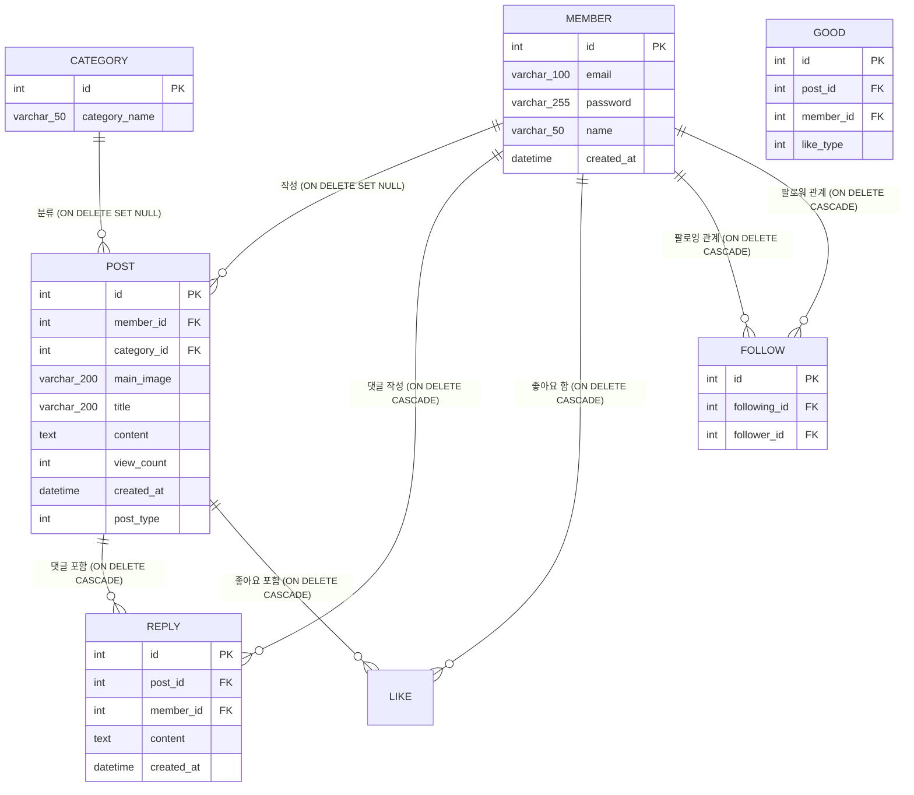

# 1. 데이터베이스 ERD 및 테이블 정의서

## 목차
- [1. 데이터베이스 ERD 및 테이블 정의서](#1-데이터베이스-erd-및-테이블-정의서)
- [1.1 Mermaid 기반 ERD 다이어그램](#11-mermaid-기반-erd-다이어그램)
- [1.2 테이블 상세 명세서](#12-테이블-상세-명세서)
- [1.3 테이블 생성 DDL 스크립트](#13-테이블-생성-ddl-스크립트)

---

## 1.1 Mermaid 기반 ERD 다이어그램



---

## 1.2 테이블 상세 명세서

### 1.2.1 member (회원 테이블)
- id: INT, PRIMARY KEY, AUTO_INCREMENT (회원 고유 식별자)
- email: VARCHAR(100), NOT NULL (이메일 아이디)
- password: VARCHAR(255), NOT NULL (비밀번호)
- name: VARCHAR(50), NOT NULL (회원 이름/별명)
- created_at: DATETIME, DEFAULT CURRENT_TIMESTAMP (가입 일시)


### 1.2.2 post (게시글 테이블)
- id: INT, PRIMARY KEY, AUTO_INCREMENT (게시글 고유 식별자)
- member_id: INT, FOREIGN KEY, NOT NULL (작성자 회원 식별자)
- category_id: INT FOREIGN KEY, NULL (카테고리 ID)
- main_image: VARCHAR(200), NULL (대표이미지)
- title: VARCHAR(200), NOT NULL (게시글 제목)
- content: TEXT, NOT NULL (게시글 본문)
- view_count: INT, DEFAULT 0 (조회수)
- created_at: DATETIME, DEFAULT CURRENT_TIMESTAMP (작성 일시)
- post_type: INT NOT NULL (1: 레시피 게시판, 2: 요리꿀팁 게시판)


### 1.2.3 reply (댓글 테이블)
- id: INT, PRIMARY KEY, AUTO_INCREMENT (댓글 고유 식별자)
- post_id: INT, FOREIGN KEY (댓글 단 게시글 ID)
- member_id: INT, FOREIGN KEY (댓글 작성자 식별자)
- content: TEXT, NOT NULL (댓글 내용)
- created_at: DATETIME, DEFAULT CURRENT_TIMESTAMP (작성 일시)


### 1.2.4 like (좋아요 테이블)
- id: INT, PRIMARY KEY, AUTO_INCREMENT (좋아요 고유 식별자)
- post_id: INT, FOREIGN KEY (좋아요한 게시글 ID)
- member_id: INT, FOREIGN KEY (좋아요 작성자 식별자)
- like_type: INT NOT NULL (1: 레시피 좋아요, 2: 요리꿀팁 좋아요, 3: 레시피 스크랩)

### 1.2.5 category (카테고리 테이블)
- id: INT, PRIMARY KEY, AUTO_INCREMENT (카테고리 고유 식별자)
- category_name: VARCHAR(50) NOT NULL (카테고리 이름)

### 1.2.6 follow (팔로우 테이블)
- id: INT, PRIMARY KEY, AUTO_INCREMENT (팔로우 고유 식별자)
- following_id: INT, FOREIGN KEY (팔로우 주체 ID) 
- follower_id: INT, FOREIGN KEY (팔로우 대상 ID)
---

## 1.3 테이블 생성 DDL 스크립트

```sql
CREATE TABLE member (
                        id INT AUTO_INCREMENT PRIMARY KEY,
                        email VARCHAR(100) NOT NULL,
                        password VARCHAR(255) NOT NULL,
                        name VARCHAR(50) NOT NULL,
                        created_at DATETIME DEFAULT CURRENT_TIMESTAMP
);

CREATE TABLE category (
                          id INT AUTO_INCREMENT PRIMARY KEY,
                          category_name VARCHAR(50) NOT NULL
);

CREATE TABLE post (
                      id INT AUTO_INCREMENT PRIMARY KEY,
                      member_id INT,
                      category_id INT,
                      main_image VARCHAR(200) NULL,
                      title VARCHAR(200) NOT NULL,
                      content TEXT NOT NULL,
                      view_count INT NOT NULL DEFAULT 0,
                      created_at DATETIME DEFAULT CURRENT_TIMESTAMP,
                      post_type INT NOT NULL,
                      CONSTRAINT fk_post_member FOREIGN KEY (member_id) REFERENCES member(id) ON DELETE SET NULL,
                      CONSTRAINT fk_post_category_id FOREIGN KEY (category_id) REFERENCES category(id) ON DELETE SET NULL
);


CREATE TABLE reply (
                       id INT AUTO_INCREMENT PRIMARY KEY,
                       post_id INT NOT NULL,
                       member_id INT NOT NULL,
                       content TEXT NOT NULL,
                       created_at DATETIME DEFAULT CURRENT_TIMESTAMP,
                       CONSTRAINT fk_reply_target_id FOREIGN KEY (post_id) REFERENCES post(id) ON DELETE CASCADE,
                       CONSTRAINT fk_reply_member FOREIGN KEY (member_id) REFERENCES member(id) ON DELETE CASCADE
);


CREATE TABLE good (
                      id INT AUTO_INCREMENT PRIMARY KEY,
                      post_id INT NOT NULL,
                      member_id INT NOT NULL,
                      like_type INT NOT NULL,
                      CONSTRAINT fk_like_member FOREIGN KEY (member_id) REFERENCES member(id) ON DELETE CASCADE,
                      CONSTRAINT fk_like_target FOREIGN KEY (post_id) REFERENCES post(id) ON DELETE CASCADE
);


CREATE TABLE follow (
                        id INT AUTO_INCREMENT PRIMARY KEY,
                        following_id INT,
                        follower_id INT,
                        CONSTRAINT fk_follow_following_id FOREIGN KEY (following_id) REFERENCES member(id) ON DELETE CASCADE,
                        CONSTRAINT fk_follow_follower_id FOREIGN KEY (follower_id) REFERENCES member(id) ON DELETE CASCADE
);
```
