# 화면 설계서 (UI Wireframe)

## 목차
- [1. 서비스 화면 구성 개요](#1-서비스-화면-구성-개요)
- [2. 주요 화면별 명세](#2-주요-화면별-명세)

---

## 1. 서비스 화면 구성 개요

### 1.1 주요 화면 목록
- 메인 화면 (GET `/`)
- 레시피 목록 페이지 (GET `/recipe/list`)
- 레시피 상세 조회 (GET `/recipe/detail?id={id}`)
- 레시피 등록 (GET `/recipe/write`)
- 레시피 수정 (GET `/recipe/edit?id={id}`)
- 요리 꿀팁 목록 페이지 (GET `/tip/list`)
- 요리 꿀팁 상세 조회 (GET `/tip/detail?id={id}`)
- 요리 꿀팁 등록 (GET `/tip/write`)
- 요리 꿀팁 수정 (GET `/tip/edit?id={id}`)
- 오늘 뭐먹지 페이지 (GET `/today/list`)

- 사용자 회원가입 (GET `/member/register`)
- 사용자 로그인 (GET `/member/login`)
- 비밀번호 찾기 (GET `/member/find-account`)
- 회원정보 수정 (GET `/member/edit`)
- 프로필(마이페이지) (GET `/member/mypage`)
- 다른 사람 프로필 (GET `/member/profile/{name}`)
- 팔로우 목록 페이지 (GET `/member/follow-list`)

---

## 2. 주요 화면별 명세

### 2.1 메인 화면 (GET `/`)
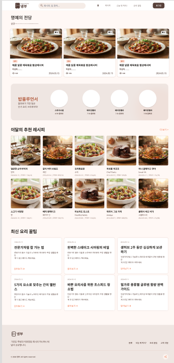

- 출력 데이터 항목 (Output Data):
    - GNB 영역: 서비스 로고 
    - 검색어 입력 폼 
    - 회원 인증 상태 정보
        - 비로그인시: 로그인 버튼
        - 로그인시: 마이페이지 버튼
    - 레시피 등록 버튼
    - 레시피 목록 버튼
    - 오늘 뭐 먹지 버튼
    - 요리꿀팁 목록 버튼
    - 목록 테이블: 게시글 번호, 제목, 작성자, 작성일시, 조회수
    - 명예의 전당 영역
        - 기간 제한 없이 전체 기간 중 추천수가 가장 높은 레시피 목록
    - 밥플루언서 영역
        - 팔로워 수를 가장 많이 보유한 추천 회원 프로필 목록
    - 이달의 추천 레시피 영역:
        - 최근 한 달 기간 내 추천수가 가장 높은 게시글 (최대 6개)
    - 최신 요리 꿀팁 영역
        - 최신순으로 정렬된 요리꿀팁 게시글(최대 6개)
    - 하단 영역
        - 푸터 정보
- 화면 제어 및 권한 규칙 (Behavior Rules):
    - 서비스 로고 클릭 시 게시글 목록 화면으로 이동
    - 검색어 입력 시 게시글 목록 검색 조회
    - 비로그인 상태: login버튼 클릭 시 로그인 페이지로 이동
    - 로그인상태: 마이페이지 버튼 클릭시 마이페이지로 이동
    - 메인 메뉴 탭(홈, 레시피, 오늘 뭐 먹지, 요리꿀팁) 클릭 시 해당 게시판 목록 페이지로 이동
    - 명예의 전당 사진 클릭 시 해당 레시피 상세 페이지로 이동
    - 밥플루언서 프로필 클릭 시 해당 회원의 프로필로 이동
    - 이달의 추천 레시피 영역의 사진 클릭시 레시피 상세 페이지로 이동
    - 요리꿀팁 게시글 클릭 시 해당 꿀팁 게시글 상세 페이지로 이동

### 2.2 레시피 목록 페이지 (GET `/recipe/list`)
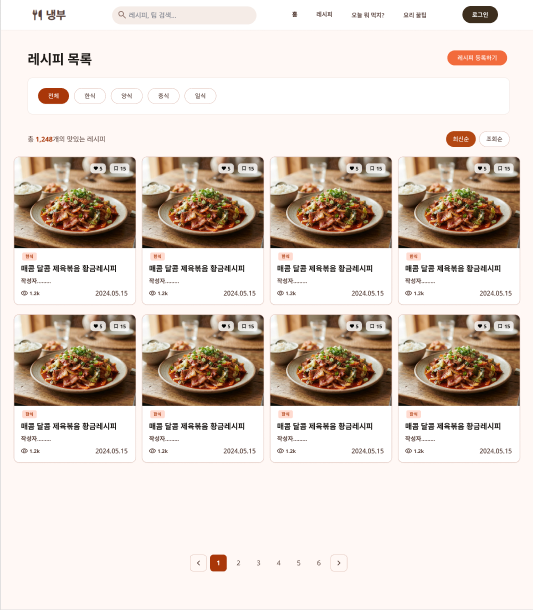

- 출력 데이터 항목 (Output Data)
  - GNB 영역
    - 서비스 로고
    - 레시피 검색어 입력 폼
    - 회원 인증 상태 정보:
      - 비로그인 시: 로그인 버튼
      - 로그인 시: 마이페이지 버튼
  - 카테고리 필터 영역:
    - 대표 카테고리 버튼 목록 (한식, 중식, 일식, 양식 등)
  - 정렬 및 목록 헤더 영역:
    - 정렬 조건 버튼 (`최신순`, `조회순`)
  - 레시피 카드 목록 영역:
    - 레시피 대표 썸네일 이미지
    - 레시피 제목, 작성자, 작성일시(날짜), 조회수, 댓글수
  - 하단 영역:
    - 페이징

- 화면 제어 및 권한 규칙 (Behavior Rules):
  - 서비스 로고 클릭 시 메인 화면(`GET /`)으로 이동합니다.
  - 검색어 입력 및 제출 시 키워드에 해당하는 레시피 목록을 검색 조회합니다.
  - 카테고리 필터 버튼(한식, 중식, 일식, 양식 등) 클릭 시 해당 카테고리의 레시피만 필터링하여 목록을 조회합니다.
  - 정렬 버튼(`최신순`, `조회순`) 클릭 시 선택한 정렬 기준에 맞춰 레시피 목록을 재정렬합니다.
  - 비로그인 상태: 로그인 버튼 클릭 시 로그인 페이지로 이동합니다.
  - 로그인 상태: MY 메뉴 및 `레시피 등록` 버튼이 활성화되며, `레시피 등록` 버튼 클릭 시 레시피 작성 페이지로 이동합니다.
  - 레시피 카드(이미지/제목) 클릭 시 해당 레시피의 상세 페이지(`GET /post/{postId}`)로 이동합니다.
  -  번호 클릭 시 해당 페이지의 레시피 목록으로 이동합니다.

### 2.3 레시피 상세 페이지 (GET `/recipe/detail?id={id}`)
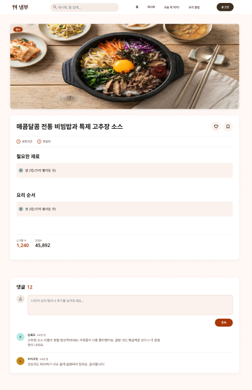

- 출력 데이터 항목 (Output Data):
  - GNB 영역:
    - 서비스 로고
    - 레시피 검색어 입력 폼
    - 회원 인증 상태 정보:
      - 비로그인 시: 로그인 버튼
      - 로그인 시: 마이페이지 버튼
  - 상단 액션 영역:
    - 스크랩 버튼 (별 아이콘 / DB: `good` 테이블, `like_type = 3` 매핑)
    - 좋아요/추천 버튼 (하트 아이콘 / DB: `good` 테이블, `like_type = 1` 매핑)
  - 레시피 대표 이미지 영역 (DB: `post` 테이블, `post_type = 1` 데이터 기준):
    - 레시피 대표 사진 (DB: `main_image` - 등록된 사진이 없을 경우 기본 이미지 출력)
  - 레시피 본문 영역:
    - 본문 내용 (재료, n인분, 요리 시간 등 상세 조리 정보 / DB: `content` 및 카테고리/인원수 등 관련 컬럼)
  - 레시피 정보 영역:
    - 작성자 닉네임
    - 스크랩수 (n개 / DB: `good` 테이블에서 해당 `post_id`와 `like_type = 3`인 레코드 수 카운트)
    - 조회수 (n회 / DB: `view_count`)
  - 댓글 영역 (DB: `reply` 테이블):
    - 댓글 목록 (작성자, 작성 내용, 작성일시 등 / DB: `reply` 테이블에서 해당 `post_id`로 조회)
    - 댓글 입력 폼 (텍스트 입력창, 등록 버튼)

- 화면 제어 및 권한 규칙 (Behavior Rules):
  - 서비스 로고 클릭 시 메인 화면(GET /)으로 이동합니다.
  - 검색어 입력 및 제출 시 해당 키워드의 레시피 검색 화면(GET /recipe/posts/search)으로 이동합니다.
  - 스크랩(별) 및 좋아요(하트) 버튼 클릭 시:
    - 로그인 상태: 스크랩/좋아요 상태가 토글(등록/취소)되며 스크랩수가 업데이트됩니다.
    - 비로그인 상태: 로그인 페이지(GET /member/login)로 이동합니다.
  - 작성자 닉네임 클릭 시 해당 작성자의 프로필 페이지(GET /member/profile/{name})로 이동합니다.
  - 댓글 등록 클릭 시:
    - 로그인 상태: 입력한 댓글 내용이 DB에 저장되고 댓글 목록이 갱신됩니다.
    - 비로그인 상태: 로그인 페이지로 이동합니다.

### 2.4 레시피 등록 화면 (GET `/recipe/write`)
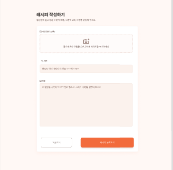

- 출력 데이터 및 입력 폼 항목 (Output & Input Data):
  - GNB 영역:
    - 서비스 로고
    - 레시피 검색어 입력 폼
    - 회원 인증 상태 정보:
      - 로그인 상태 전용 화면이므로 마이페이지 버튼 및 레시피 등록 버튼 활성화
- 대표 사진 등록 영역:
  - 이미지 업로드 버튼 (DB: `main_image`, `original_filename`, `content_type`)
- 텍스트 입력 영역 (DB: `post` 테이블, `post_type = 1`로 매핑):
  - 레시피 제목 (DB: `title`)
  - 레시피 소개, 재료 정보, 요리 순서 (Toast UI 에디터 및 비동기 이미지 업로드 연동 / DB: `content`)
- 부가 정보 선택 영역 (Select 박스):
  - 종류: 대표 카테고리 (한식, 중식, 양식, 일식 등 / DB: `category_id`)
- 하단 액션 버튼 영역:
  - 작성 취소하기 버튼
  - 레시피 등록하기 버튼 (`POST /recipe/write`)

- 화면 제어 및 권한 규칙 (Behavior Rules):
  - 서비스 로고 클릭 시 메인 화면(GET /)으로 이동합니다.
  - 대표 사진 등록 영역 클릭 시: 사용자의 파일 탐색기가 열리며, 선택한 이미지 파일은 `FileStore`를 통해 안전하게 서버에 저장됩니다.
  - 작성 취소하기 버튼 클릭 시: 이전 페이지 또는 레시피 목록 화면(GET /recipe/list)으로 이동합니다.
  - 레시피 등록하기 버튼 클릭 시:
    - 비로그인 상태일 경우 로그인 페이지(GET /member/login)로 리다이렉트됩니다.
    - `@Valid` 및 `BindingResult`를 통해 필수 입력 항목 및 유효성 검사를 진행합니다.
    - 유효성 검증 실패 시 입력 폼으로 복귀하여 에러 메시지를 출력합니다.
    - 모든 데이터가 정상 입력되었다면 서버로 전송되어 DB에 저장된 후 레시피 목록 페이지(GET /recipe/list)로 이동합니다.

### 2.5 레시피 수정 화면 (GET `/recipe/edit?id={id}`)

- 출력 데이터 및 입력 폼 항목 (Output & Input Data):
  - GNB 영역:
    - 서비스 로고
    - 레시피 검색어 입력 폼
    - 회원 인증 상태 정보:
      - 로그인 상태 전용 화면이므로 마이페이지 버튼 및 레시피 등록 버튼 활성화
  - 기존 데이터 바인딩(미리 채워짐) 영역 (DB: `post` 테이블의 해당 `id` 데이터):
    - 대표 사진: 기존에 등록된 이미지(`main_image`, `original_filename`) 썸네일 노출 및 변경 파일 업로드 폼
    - 레시피 제목: 기존 입력된 제목(`title`) 노출
    - 레시피 본문: 소개, 재료 정보, 요리 순서 (Toast UI 에디터) 기존 내용(`content`) 노출
    - 부가 정보(Select 박스): 기존에 선택했던 대표 카테고리(`category_id`) 값으로 세팅
  - 하단 액션 버튼 영역:
    - 작성 취소하기 버튼
    - 레시피 수정하기 버튼 (`POST /recipe/edit`)

- 화면 제어 및 권한 규칙 (Behavior Rules):
  - 화면 진입 시:
    - 세션 로그인 여부 및 작성자 본인 여부를 검증합니다.
    - 서버에서 파라미터의 `id`에 해당하는 게시글 데이터를 불러와(`recipePostForm` 모델) 각 입력 폼에 기존 작성 내용을 바인딩해 줍니다.
  - 삭제하기 버튼 클릭 시:
    - 서버(POST `/recipe/delete`)로 삭제를 요청(`id` 파라미터 전송)하여 DB에서 해당 게시글을 지우고, 사용자를 마이페이지로 이동시킵니다.
  - 레시피 수정하기 버튼 클릭 시:
    - 비로그인 상태일 경우 로그인 페이지(GET `/member/login`)로 리다이렉트됩니다.
    - `@Valid` 및 `BindingResult`를 통해 필수 입력 항목 및 유효성 검사를 진행합니다.
    - 새로운 파일 첨부 여부에 따라 `FileStore`를 통한 신규 파일 저장 또는 기존 첨부파일 정보 유지 로직이 수행됩니다.
    - 수정이 완료되면 마이페이지(GET `/member/mypage`)로 즉시 이동합니다.

### 2.6 요리 꿀팁 목록 페이지 (GET `/tip/list`)
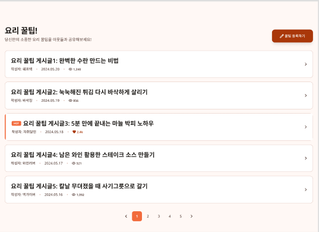

- 출력 데이터 항목 (Output Data):
  - GNB 영역:
    - 서비스 로고
    - 검색어 입력 폼
    - 회원 인증 상태 정보:
      - 비로그인 시: 로그인 버튼
      - 로그인 시: 마이페이지 버튼
  - 타이틀 및 헤더 영역:
    - 페이지 타이틀 (요리 꿀팁!)
    - 서브 텍스트 (요리 꿀팁을 공유해보세요!)
    - 꿀팁 등록하기 버튼
  - 요리 꿀팁 게시글 목록 영역 (`posts` / DB: `post` 테이블, `post_type = 2`인 데이터):
    - 꿀팁 게시글 항목 (제목, 작성자, 작성일시, 조회수 등)
  - 하단 영역:
    - 페이지네이션 (`page`, `totalPage` 기반 번호 및 이전/다음 이동)

- 화면 제어 및 권한 규칙 (Behavior Rules):
  - 서비스 로고 클릭 시 메인 화면(GET `/`)으로 이동합니다.
  - 꿀팁 등록하기 버튼 클릭 시:
    - 로그인 상태: 요리 꿀팁 작성 페이지(GET `/tip/write`)로 이동합니다.
    - 비로그인 상태: 로그인 페이지(GET `/member/login`)로 이동합니다.
  - 요리 꿀팁 게시글 항목 클릭 시: 해당 게시글의 상세 페이지(GET `/tip/detail?id={id}`)로 이동합니다.
  - 페이지 번호 및 화살표 클릭 시: 해당하는 페이지의 요리 꿀팁 목록 데이터(기본 8개씩)로 화면을 갱신합니다.
  - GNB 영역의 로그인 버튼 클릭 시 로그인 페이지로 이동합니다.
  - 로그인 상태: GNB 영역의 MY 메뉴 및 레시피 등록 버튼이 활성화됩니다.

### 2.7 요리 꿀팁 상세 페이지 (GET `/tip/detail?id={id}`)
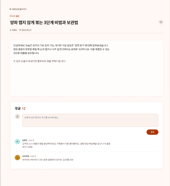

- 출력 데이터 항목 (Output Data):
  - GNB 영역:
    - 서비스 로고
    - 검색어 입력 폼
    - 회원 인증 상태 정보:
      - 비로그인 시: 로그인 버튼
      - 로그인 시: 마이페이지 버튼
  - 상단 액션 영역:
    - 스크랩 버튼 (별 아이콘 / DB: `good` 테이블, `like_type = 3`)
    - 좋아요 버튼 (하트 아이콘 / DB: `good` 테이블, `like_type = 2`)
  - 게시글 정보 및 본문 영역 (DB: `post` 테이블, `post_type = 2`):
    - 게시글 제목 (DB: `title`)
    - 요리 꿀팁 내용 본문 (Toast UI 에디터 / DB: `content`)
  - 게시글 메타 정보 영역:
    - 작성자 닉네임/프로필 (DB: `member` 테이블 참조)
    - 스크랩수 (n개 / DB: `good` 테이블에서 해당 `post_id`와 `like_type = 3`인 레코드 수 카운트)
    - 조회수 (n회 / DB: `view_count` / 쿠키 기반 24시간 중복 증가 방지 적용)
  - 댓글 영역 (DB: `reply` 테이블):
    - 댓글 목록 (작성자, 작성 내용, 작성일시 등 / DB: `reply` 테이블에서 해당 `post_id`로 조회)
    - 댓글 입력 폼 (텍스트 입력창, 등록 버튼)

- 화면 제어 및 권한 규칙 (Behavior Rules):
  - 서비스 로고 클릭 시 메인 화면(GET `/`)으로 이동합니다.
  - 검색어 입력 및 제출 시 해당 키워드의 검색 결과 화면(GET `/recipe/posts/search`)으로 이동합니다.
  - 스크랩(별) 및 좋아요(하트) 버튼 클릭 시:
    - 로그인 상태: 상태가 토글(등록/취소)되며 카운트가 업데이트됩니다.
    - 비로그인 상태: 로그인 페이지(GET `/member/login`)로 이동합니다.
  - 작성자 닉네임 클릭 시 해당 작성자의 프로필 페이지(GET `/member/profile/{name}`)로 이동합니다.
  - 댓글 등록 클릭 시:
    - 로그인 상태: 입력한 댓글 내용이 DB에 저장되고 댓글 목록이 갱신됩니다.
    - 비로그인 상태: 로그인 페이지로 이동합니다.
  - 비로그인 상태: GNB 영역의 로그인 버튼 클릭 시 로그인 페이지로 이동합니다.
  - 로그인 상태: GNB 영역의 MY 메뉴 및 레시피 등록 버튼이 활성화되며, 레시피 등록 버튼 클릭 시 레시피 작성 페이지(GET `/recipe/write`)로 이동합니다.

### 2.8 요리 꿀팁 등록 화면 (GET `/tip/write`)
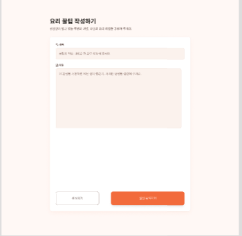

- 출력 데이터 및 입력 폼 항목 (Output & Input Data):
  - GNB 영역:
    - 서비스 로고
    - 검색어 입력 폼
    - 회원 인증 상태 정보:
      - 로그인 시 마이페이지 버튼 활성화
  - 타이틀 영역:
    - 페이지 타이틀 (요리 꿀팁 작성하기)
  - 텍스트 입력 영역 (DB: `post` 테이블, `post_type = 2`로 매핑):
    - 제목 입력칸 (DB: `title`)
    - 내용 입력칸 (Toast UI 에디터 및 비동기 이미지 업로드 연동 / DB: `content`)
  - 하단 액션 버튼 영역:
    - 취소하기 버튼
    - 꿀팁 등록하기 버튼 (`POST /tip/write`)

- 화면 제어 및 권한 규칙 (Behavior Rules):
  - 서비스 로고 클릭 시 메인 화면(GET `/`)으로 이동합니다.
  - 취소하기 버튼 클릭 시: 이전 페이지 또는 요리 꿀팁 목록 화면(GET `/tip/list`)으로 이동합니다.
  - 꿀팁 등록하기 버튼 클릭 시:
    - 비로그인 상태일 경우 로그인 페이지(GET `/member/login`)로 리다이렉트됩니다.
    - `@Valid` 및 `BindingResult`를 통해 제목과 내용 등 필수 항목의 유효성 검사를 진행합니다.
    - 유효성 검증 실패 시 작성 폼으로 복귀하여 에러 메시지를 출력합니다.
    - 모든 데이터가 정상 입력되었다면 서버로 전송되어 DB에 저장(`post_type = 2`)된 후 요리 꿀팁 목록 페이지(GET `/tip/list`)로 이동합니다.

### 2.9 요리 꿀팁 수정 화면 (GET `/tip/edit?id={id}`)

- 출력 데이터 및 입력 폼 항목 (Output & Input Data):
  - GNB 영역:
    - 서비스 로고
    - 검색어 입력 폼
    - 회원 인증 상태 정보:
      - 로그인 상태 전용 화면이므로 마이페이지 버튼 및 레시피 등록 버튼 활성화
  - 타이틀 영역:
    - 페이지 타이틀 (요리 꿀팁 작성하기 - ※ 수정 모드로 동작)
  - 기존 데이터 바인딩(미리 채워짐) 영역 (DB: `post` 테이블의 해당 `id` 데이터, `post_type = 2`):
    - 제목: 기존에 입력된 제목(`title`) 노출
    - 내용: 기존에 작성된 꿀팁 본문 (Toast UI 에디터 / `content`) 노출
  - 하단 액션 버튼 영역:
    - 꿀팁 삭제하기 버튼 (POST `/tip/delete`)
    - 꿀팁 수정하기 버튼 (POST `/tip/edit`)

- 화면 제어 및 권한 규칙 (Behavior Rules):
  - 화면 접근 권한: 로그인한 상태이면서, 해당 꿀팁 게시글의 작성자 본인(DB `post` 테이블의 `member_id`와 현재 로그인한 회원의 ID가 일치)만 접근 가능한 페이지입니다. 권한이 없거나 미로그인 시 상세 페이지(GET `/tip/detail?id={id}`)로 리다이렉트됩니다.
  - 화면 진입 시: 서버에서 파라미터의 `id`에 해당하는 요리 꿀팁 데이터를 불러와(`postForm` 모델) 제목과 내용 폼에 기존 작성 내용을 미리 채워줍니다(Pre-loading).
  - 꿀팁 삭제하기 버튼 클릭 시:
    - 서버(POST `/tip/delete`)로 삭제를 요청(`id` 및 세션 검증)하여 DB에서 해당 게시글을 삭제하고, 요리 꿀팁 목록 화면(GET `/tip/list`)으로 이동합니다.
  - 꿀팁 수정하기 버튼 클릭 시:
    - 로그인 상태 및 작성자 본인 여부를 재검증합니다.
    - 서버(POST `/tip/edit`)로 수정된 데이터를 전송하여 DB의 내용을 업데이트합니다.
    - 수정 처리가 완료되면, 해당 요리 꿀팁의 상세 페이지(GET `/tip/detail?id={id}`)로 즉시 이동합니다.

### 2.10 오늘 뭐먹지 (랜덤 추천) 화면 (GET `/today/list`)
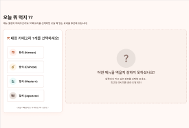

- 출력 데이터 항목 (Output Data):
  - GNB 영역:
    - 서비스 로고
    - 검색어 입력 폼
    - 회원 인증 상태 정보:
      - 비로그인 시: 로그인 버튼
      - 로그인 시: 마이페이지 (마이페이지 이동, 내 정보 수정, 로그아웃) 및 레시피 등록 버튼
  - 타이틀 및 안내 영역:
    - 메인 타이틀 ("오늘 뭐먹지 ??")
    - 서브 텍스트 ("카테고리를 선택하시면 오늘 먹을 레시피 추천해드립니다!")
  - 카테고리 필터 영역:
    - 대표 카테고리 선택 버튼 (한식, 중식, 일식, 양식 등)
  - 랜덤 추천 결과 영역 (`post` / DB: `post` 테이블 참조):
    - 선택된 카테고리(`categoryId`)와 레시피 게시글(`post_type = 1`) 조건에 일치하는 데이터 중 랜덤으로 1개를 추출하여 표시 (`postService.getRandomRecipePost(categoryId)`)
    - 노출 항목: 레시피 대표 이미지(`main_image`), 제목 등

- 화면 제어 및 권한 규칙 (Behavior Rules):
  - 서비스 로고 클릭 시 메인 화면(GET `/`)으로 이동합니다.
  - 검색어 입력 및 제출 시 해당 키워드의 레시피 검색 화면(GET `/recipe/posts/search`)으로 이동합니다.
  - 카테고리 버튼(한식, 중식, 일식, 양식 등) 클릭 시 (GET `/today/recommend?categoryId={categoryId}`):
    - DB에서 해당 카테고리에 속한 레시피 중 하나를 무작위로 불러와 화면에 출력합니다.
    - 해당하는 게시글이 없을 경우 에러 메시지("해당 카테고리의 게시글이 없습니다.")가 함께 모델에 담겨 뷰로 전달됩니다.
  - 추천된 레시피 결과물(사진/제목) 클릭 시: 해당 레시피의 상세 페이지(GET `/recipe/detail?id={id}`)로 이동합니다.
  - 비로그인 상태: 로그인 버튼 클릭 시 로그인 페이지(GET `/member/login`)로 이동합니다.
  - 로그인 상태: GNB 영역의 MY 메뉴 및 레시피 등록 버튼이 활성화됩니다.

### 2.11 회원가입 화면 (GET `/member/register`)
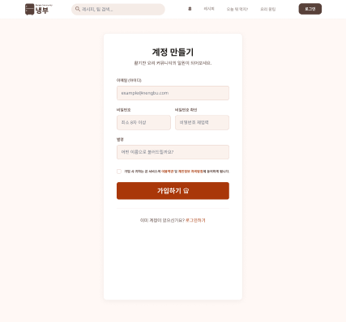

- 출력 데이터 및 입력 폼 항목 (Output & Input Data):
  - 타이틀 영역:
    - 페이지 타이틀 (회원가입)
  - 회원 정보 입력 영역 (DB: `member` 테이블과 매핑):
    - 아이디(이메일) 입력 폼 (DB: `email`)
    - 비밀번호 입력 폼 (DB: `password`)
    - 비밀번호 확인 입력 폼 (`passwordConfirm` / 비밀번호 일치 여부 검증용)
    - 별명(이름) 입력 폼 (DB: `name`)
    - 전화번호 입력 폼 (DB: `phone`)
  - 하단 액션 버튼 영역:
    - 가입하기 버튼 (`POST /member/register`)

- 화면 제어 및 권한 규칙 (Behavior Rules):
  - 아이디(이메일) 및 별명 중복 검증: 서버단에서 `@Valid` 검증 및 `DuplicateEmailException`, `DuplicateNameException` 발생 시 `BindingResult`를 통해 필드 에러(`rejectValue`)를 처리하고 가입 폼(`member/register`)으로 복귀합니다.
  - 비밀번호 확인 로직: '비밀번호' 항목과 '비밀번호 확인' 항목에 입력된 값이 일치하지 않을 경우 `bindingResult.rejectValue("password", ...)`를 통해 에러를 처리합니다.
  - 가입하기 버튼 클릭 시:
    - 모든 필수 항목이 누락 없이 입력되었는지 유효성 검사를 진행합니다.
    - 모든 검증을 통과하면 입력된 데이터를 서버로 전송하여 신규 회원 데이터로 DB에 저장합니다.
    - 정상적으로 회원가입이 완료되면 로그인 페이지(GET `/member/login`)로 즉시 리다이렉트됩니다.

### 2.12 사용자 로그인 화면 (GET `/member/login`)
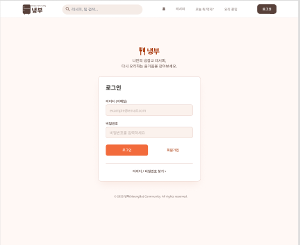

- 출력 데이터 및 입력 폼 항목 (Output & Input Data):
  - 타이틀 영역:
    - 페이지 타이틀 (로그인)
  - 계정 정보 입력 영역 (DB: `member` 테이블 참조):
    - 아이디(이메일) 입력 폼 (DB: `email`)
    - 비밀번호 입력 폼 (DB: `password`)
  - 하단 액션 버튼 및 링크 영역:
    - 로그인 버튼 (`POST /member/login`)
    - 회원가입 버튼
    - 아이디/비밀번호 찾기 텍스트 링크

- 화면 제어 및 권한 규칙 (Behavior Rules):
  - 이미 로그인한 사용자가 접근할 경우: 메인 화면(GET `/`)으로 자동 리다이렉트됩니다.
  - 로그인 버튼 클릭 시:
    - 입력된 이메일과 비밀번호를 서버로 전송(`POST /member/login`)하여 DB의 `member` 정보와 대조합니다.
    - 인증 성공 시: 세션(`session.setAttribute("loginMember", loginMember)`)에 회원 정보를 저장하고 메인 화면(GET `/`)으로 이동합니다.
    - 인증 실패 시: 에러 메시지("이메일 또는 비밀번호가 맞지 않습니다.")를 모델에 담아 로그인 페이지(`member/login`)로 돌아와 재입력을 유도합니다.
  - 회원가입 버튼 클릭 시: 신규 회원가입 페이지(GET `/member/register`)로 이동합니다.
  - 아이디/비밀번호 찾기 클릭 시: 계정 찾기 페이지(GET `/member/find-account`)로 이동합니다.

### 2.13 회원정보 수정 화면 (GET `/member/edit`)
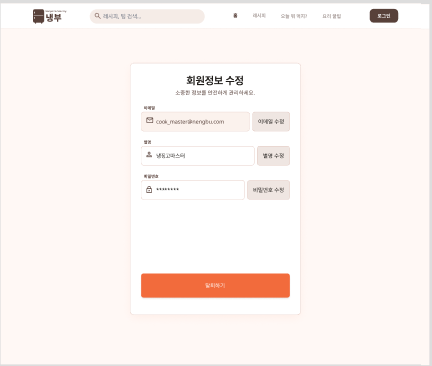

- 출력 데이터 및 입력 폼 항목 (Output & Input Data):
  - 타이틀 영역:
    - 페이지 타이틀 (회원정보 수정)
  - 회원 정보 수정 영역 (DB: `member` 테이블 참조):
    - 이메일 항목: 현재 등록된 이메일이 출력되는 텍스트 입력 폼 (DB: `email`)
    - 별명 항목: 현재 등록된 별명이 출력되는 텍스트 입력 폼 (`member.name`) 및 별명 수정 버튼 (`POST /member/edit/name`)
    - 비밀번호 항목: 비밀번호 변경을 위한 입력 폼 (`member.password`) 및 비밀번호 수정 버튼 (`POST /member/edit/password`)
  - 하단 액션 버튼 영역:
    - 탈퇴하기 버튼 (`POST /member/delete`)

- 화면 제어 및 권한 규칙 (Behavior Rules):
  - 화면 접근 권한: `LoginCheckInterceptor` 등 세션 로그인이 완료된 사용자만 접근할 수 있는 페이지입니다. 비로그인 시 로그인 페이지로 리다이렉트됩니다.
  - 별명 및 비밀번호 수정 버튼 클릭 시:
    - `@Valid` 및 `BindingResult`를 통해 입력값의 유효성 검사를 거칩니다.
    - 별명 수정 시 중복 검증(`DuplicateNameException`)을 수행하며, 성공 시 세션 정보(`loginMember`)와 DB를 갱신하고 마이페이지(GET `/member/mypage`)로 이동합니다.
    - 비밀번호 수정 시 암호화 및 DB 업데이트 후 마이페이지로 이동합니다.
  - 탈퇴하기 버튼 클릭 시:
    - "정말 탈퇴하시겠습니까?" 등의 재확인 과정을 거친 뒤 서버(POST `/member/delete`)로 탈퇴를 요청합니다.
    - DB에서 회원 데이터를 삭제하고, 세션 무효화(`session.invalidate()`) 처리 후 서비스 메인 화면(GET `/`)으로 이동합니다.

### 2.14 프로필(마이페이지) 화면 (GET `/member/mypage` 및 GET `/member/profile/{name}`)
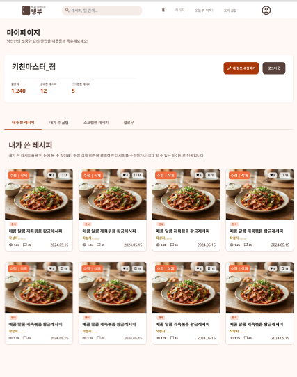

- 출력 데이터 항목 (Output Data):
  - 상단 액션 영역:
    - 타이틀 (마이페이지 또는 프로필)
    - 로그아웃 버튼 (`POST /member/logout`)
  - 프로필 정보 영역 (DB: `member`, `follow` 테이블 참조):
    - 별명 (DB: `name`)
    - 팔로워 수 텍스트 ("나를 구독한 팔로워 n명" / DB: `follow` 테이블에서 `following_id`가 해당 회원인 레코드 수 카운트)
  - 탭(Tab) 및 네비게이션 버튼 영역:
    - [내가 쓴 레시피] (`myRecipes`)
    - [내가 쓴 꿀팁] (`myTips`)
    - [스크랩한 레시피] (`myScarpRecipes`) 및 [스크랩한 꿀팁] (`myScarpTips`)
    - [팔로우/구독] (`myFollowing`, `followerCount`)
    - [내정보수정] (`/member/edit` - 본인 마이페이지 전용) 또는 [팔로우 하기/취소] (타인 프로필 전용)
  - 콘텐츠 목록 영역 (DB: `post`, `good`, `follow` 테이블):
    - 작성한 레시피, 꿀팁, 스크랩 목록, 팔로잉 목록 데이터

- 화면 제어 및 권한 규칙 (Behavior Rules):
  - 로그아웃 버튼 클릭 시: 세션을 무효화(`session.invalidate()`)하고 비로그인 상태로 메인 화면(GET `/`)으로 이동합니다.
  - 내정보수정 버튼 클릭 시: 회원정보 수정 페이지(GET `/member/edit`)로 이동합니다.
  - 네비게이션 버튼(탭) 클릭 시:
    - [내가 쓴 레시피]: 해당 회원이 작성한 레시피 게시글(`post_type=1`) 목록을 출력합니다.
    - [내가 쓴 꿀팁]: 해당 회원이 작성한 꿀팁 게시글(`post_type=2`) 목록을 출력합니다.
    - [스크랩한 레시피/꿀팁]: 해당 회원이 스크랩(`good` 테이블의 `like_type = 3`)한 게시글 목록을 갱신합니다.
    - [팔로우]: 팔로잉/구독 목록 페이지(GET `/member/follow-list`) 또는 관련 정보로 이동합니다.
  - 콘텐츠 목록 클릭 제어:
    - 게시글 제목/이미지 영역 클릭 시: 해당 레시피(GET `/recipe/detail?id={id}`) 또는 꿀팁(GET `/tip/detail?id={id}`)의 상세 페이지로 이동합니다.
    - 내 마이페이지에서 작성글의 [수정]/[삭제] 버튼 클릭 시 각각 수정 폼(GET `/recipe/edit` 또는 `/tip/edit`) 및 삭제 요청(POST `/recipe/delete` 또는 `/tip/delete`)으로 연동됩니다.

### 2.15 다른 사람 프로필 페이지 (GET `/member/profile/{name}`)
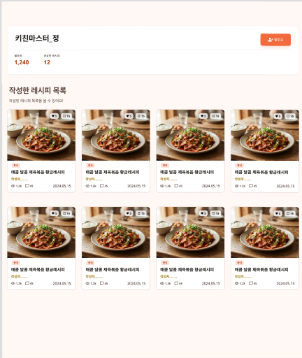

- 출력 데이터 항목 (Output Data):
  - 프로필 정보 영역 (DB: `member`, `follow` 테이블 참조):
    - 별명 (DB: `name`)
    - 팔로워 수 텍스트 ("팔로우수 n명" / DB: `follow` 테이블에서 `following_id`가 해당 회원인 레코드 수 카운트)
    - 팔로우 버튼 (DB: 현재 로그인한 사용자와의 팔로우 관계 여부에 따라 '팔로우' 또는 '팔로잉/언팔로우' 상태 표시 / `isFollowing`)
  - 작성 글 목록 영역 (그리드 형태 / DB: `post` 테이블 참조):
    - 해당 회원이 작성한 레시피 게시글 카드 리스트 (`myRecipes`)
    - 레시피 제목 (DB: `title`)
    - 작성 날짜 (DB: `created_at`)
    - 조회수 (DB: `view_count`)

- 화면 제어 및 권한 규칙 (Behavior Rules):
  - 본인 프로필 접근 시: URL로 자신의 이름을 입력해 접근할 경우 마이페이지(GET `/member/mypage`)로 자동 리다이렉트됩니다.
  - 존재하지 않는 회원 조회 시: 메인 화면(GET `/`)으로 리다이렉트됩니다.
  - 팔로우 버튼 클릭 시:
    - 로그인 상태: DB의 `follow` 테이블을 통해 팔로우 상태가 토글되며 버튼 및 팔로워 수가 갱신됩니다.
    - 비로그인 상태: 로그인 페이지(GET `/member/login`)로 이동합니다.
  - 작성 글(레시피 카드) 클릭 시: 해당 레시피의 상세 페이지(GET `/recipe/detail?id={id}`)로 이동합니다.

 
## 3. 전체 화면 와이어프레임 배치도
- [와이어프레임 통합 파일 링크](https://www.tldraw.com/f/W34odRZEVIts2UaVExVTj?d=v3466.-1480.2495.1432.page)

