# 화면 설계서 (UI Wireframe)

## 목차
- [1. 서비스 화면 구성 개요](#1-서비스-화면-구성-개요)
- [2. 주요 화면별 명세](#2-주요-화면별-명세)

---

## 1. 서비스 화면 구성 개요

### 1.1 주요 화면 목록
- 메인 화면 (GET `/`)
- 레시피 목록 페이지(GET `/post?type=1`)
- 레시피 상세 조회 (GET `/post/{postId}`)
- 레시피 등록 (GET `/post/form?type=1`)
- 레시피 수정 (GET  `/post/{postId}/edit`)
- 요리 꿀팁 목록 페이지(GET  `/post?type=2`)
- 요리 꿀팁 상세 조회 (GET `/post/{postId}`)
- 요리 꿀팁 등록 (GET `/post/form?type=2`)
- 요리 꿀팁 수정 (GET `/post/{postId}/t-edit`)
- 오늘 뭐먹지 페이지 (GET `/today-recipes`)

- 사용자 회원가입 (GET `/member/signup`)
- 사용자 로그인 (GET `/login`)
-  비밀번호 찾기 (GET `/member/find`)
- 회원정보 수정 (GET `/member/{memberId}/edit`)
- 프로필(마이페이지) (Get `/member/{memberId}`)
- 다른 사람 프로필 (GET `/members/{memberId}`)
- 팔로우 피드 페이지 (GET `/subscriptions`)

---

## 2. 주요 화면별 명세

### 2.1 메인 화면 (GET `/index`)
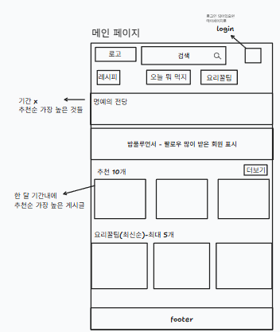

- 출력 데이터 항목 (Output Data):
    - GNB 영역: 서비스 로고 
    - 검색어 입력 폼 
    - 회원 인증 상태 정보
        - 비로그인시: 로그인 버튼
        - 로그인시: MY 셀렉트 박스(클릭 시 마이페이지 이동/ 내 정보수정/ 로그아웃)
    - 레시피 등록 버튼
    - 레시피 목록 버튼
    - 오늘 뭐 먹지 버튼
    - 요리꿀팁 목록 버튼
    - 목록 테이블: 게시글 번호, 제목, 작성자, 작성일시, 조회수
    - 명예의 전당 영역
        - 기간 제한 없이 전체 기간 중 추천수가 가장 높은 레시피 목록
    - 밥플루언서 영역
        - 팔로워 수를 가장 많이 보유한 추천 회원 프로필 목록
    - 이달의 추천 레시피 영역:
        - 최근 한 달 기간 내 추천수가 가장 높은 게시글 (최대 6개)
    - 최신 요리 꿀팁 영역
        - 최신순으로 정렬된 요리꿀팁 게시글(최대 5개)
    - 하단 영역
        - 푸터 정보
- 화면 제어 및 권한 규칙 (Behavior Rules):
    - 서비스 로고 클릭 시 게시글 목록 화면으로 이동
    - 검색어 입력 및 제출 시 조건별 게시글 목록 검색 조회
    - 비로그인 상태: login버튼 클릭 시 로그인 페이지로 이동
    - 로그인상태: my메뉴(내 정보 수정, 페이지 이동, 로그아웃 기능 지원)과 레시피 등록 버튼이 활성화
    - 메인 메뉴 탭(레시피, 오늘 뭐 먹지, 요리꿀팁) 클릭 시 해당 게시판 목록 페이지로 이동
    - 명예의 전당 사진 클릭 시 해당 레시피 상세 페이지로 이동
    - 밥플루언서 프로필 클릭 시 해당 회원의 프로필로 이동
    - 이달의 추천 레시피 영역의 사진 클릭시 레시피 상세 페이지로 이동
    - 요리꿀팁 게시글 클릭 시 해당 꿀팁 게시글 상세 페이지로 이동

### 2.2 레시피 목록 페이지 (GET `/post?type=1`)
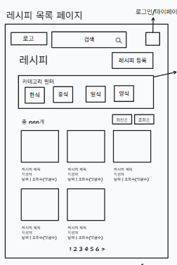

- 출력 데이터 항목 (Output Data)
  - GNB 영역
    - 서비스 로고
    - 레시피 검색어 입력 폼
    - 회원 인증 상태 정보:
      - 비로그인 시: 로그인 버튼
      - 로그인 시: MY 셀렉트 박스 (마이페이지 이동, 내 정보 수정, 로그아웃) 및 레시피 등록 버튼
  - 카테고리 필터 영역:
    - 대표 카테고리 버튼 목록 (한식, 중식, 일식, 양식 등)
  - 정렬 및 목록 헤더 영역:
    - 정렬 조건 버튼 (`최신순`, `조회순`)
  - 레시피 카드 목록 영역:
    - 레시피 대표 썸네일 이미지
    - 레시피 제목, 작성자, 작성일시(날짜), 조회수, 댓글수
  - 하단 영역:
    - 페이징

- 화면 제어 및 권한 규칙 (Behavior Rules):
  - 서비스 로고 클릭 시 메인 화면(`GET /`)으로 이동합니다.
  - 검색어 입력 및 제출 시 키워드에 해당하는 레시피 목록을 검색 조회합니다.
  - 카테고리 필터 버튼(한식, 중식, 일식, 양식 등) 클릭 시 해당 카테고리의 레시피만 필터링하여 목록을 조회합니다.
  - 정렬 버튼(`최신순`, `조회순`) 클릭 시 선택한 정렬 기준에 맞춰 레시피 목록을 재정렬합니다.
  - 비로그인 상태: 로그인 버튼 클릭 시 로그인 페이지로 이동합니다.
  - 로그인 상태: MY 메뉴 및 `레시피 등록` 버튼이 활성화되며, `레시피 등록` 버튼 클릭 시 레시피 작성 페이지로 이동합니다.
  - 레시피 카드(이미지/제목) 클릭 시 해당 레시피의 상세 페이지(`GET /post/{postId}`)로 이동합니다.
  -  번호 클릭 시 해당 페이지의 레시피 목록으로 이동합니다.

### 2.3 레시피 상세 페이지 (GET `/post/{postId}`)
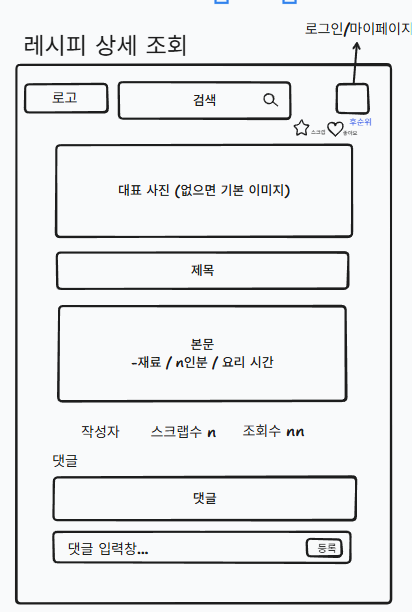

- 출력 데이터 항목 (Output Data):
  - GNB 영역:
    - 서비스 로고
    - 레시피 검색어 입력 폼
    - 회원 인증 상태 정보:
      - 비로그인 시: 로그인 버튼
      - 로그인 시: MY 셀렉트 박스 (마이페이지 이동, 내 정보 수정, 로그아웃) 및 레시피 등록 버튼
  - 상단 액션 영역:
    - 스크랩 버튼 (별 아이콘 / DB: `like` 테이블, `like_type = 3` 매핑)
    - 좋아요/추천 버튼 (하트 아이콘 / DB: `like` 테이블, `like_type = 1` 매핑)
  - 레시피 대표 이미지 영역 (DB: `post` 테이블, `post_type = 1` 데이터 기준):
    - 레시피 대표 사진 (DB: `main_image` - 등록된 사진이 없을 경우 기본 이미지 출력)
  - 레시피 본문 영역:
    
    - 본문 내용 (재료, n인분, 요리 시간 등 상세 조리 정보 / DB: `content` 및 카테고리/인원수 등 관련 컬럼)
  - 레시피 정보 영역:
    - 작성자 닉네임
    - 스크랩수 (n개 / DB: `like` 테이블에서 해당 `post_id`와 `like_type = 3`인 레코드 수 카운트)
    - 조회수 (n회 / DB: `view_count`)
  - 댓글 영역 (DB: `reply` 테이블):
    - 댓글 목록 (작성자, 작성 내용, 작성일시 등 / DB: `reply` 테이블에서 해당 `post_id`로 조회)
    - 댓글 입력 폼 (텍스트 입력창, 등록 버튼)

- 화면 제어 및 권한 규칙 (Behavior Rules):
  - 서비스 로고 클릭 시 메인 화면(GET /)으로 이동합니다.
  - 검색어 입력 및 제출 시 해당 키워드의 레시피 목록 화면(GET /recipeposts)으로 이동합니다.
  - 스크랩(별) 및 좋아요(하트) 버튼 클릭 시:
    - 로그인 상태: 스크랩/좋아요 상태가 토글(등록/취소)되며 스크랩수가 업데이트됩니다.
    - 비로그인 상태: 로그인 안내 메시지 노출 후 로그인 페이지(GET /login)로 이동합니다.
  - 작성자 닉네임 클릭 시 해당 작성자의 프로필 페이지(GET /members/{memberId})로 이동합니다.
  - 댓글 등록 클릭 시:
    - 로그인 상태: 입력한 댓글 내용이 DB에 저장되고 댓글 목록이 갱신됩니다.
    - 비로그인 상태: 로그인 안내 메시지 노출 후 로그인 페이지로 이동합니다.

### 2.4 레시피 등록 화면 (GET `/post/form?type=1`)
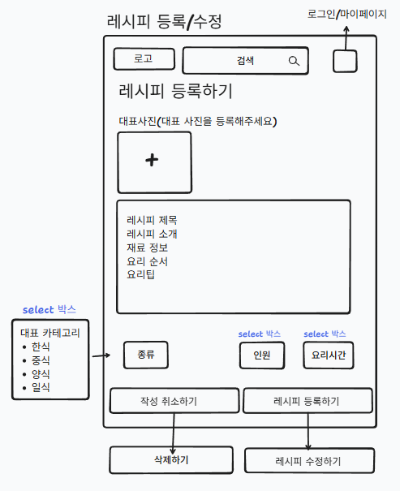

- 출력 데이터 및 입력 폼 항목 (Output & Input Data):
  - GNB 영역:
    - 서비스 로고
    - 레시피 검색어 입력 폼
    - 회원 인증 상태 정보:
      - 로그인 상태 전용 화면이므로 MY 셀렉트 박스 및 레시피 등록 버튼 활성화
- 대표 사진 등록 영역:
  - 이미지 업로드 버튼 (DB: `main_image`)
- 텍스트 입력 영역 (DB: `post` 테이블, `post_type = 1`로 매핑):
  - 레시피 제목 (DB: `title`)
  - 레시피 소개, 재료 정보, 요리 순서, 요리팁 (DB: `content`)
- 부가 정보 선택 영역 (Select 박스):
  - 종류: 대표 카테고리 (한식, 중식, 양식, 일식 / DB: `category_id`)
    - 인원: 요리 분량 (n인분)
    - 요리시간: 소요 시간
  - 하단 액션 버튼 영역:
    - 작성 취소하기 버튼
    - 레시피 등록하기 버튼

- 화면 제어 및 권한 규칙 (Behavior Rules):
  - 서비스 로고 클릭 시 메인 화면(GET /)으로 이동합니다.
  - 대표 사진 등록(+) 영역 클릭 시: 사용자의 파일 탐색기가 열리며, 이미지 선택 시 해당 영역에 미리보기가 적용됩니다.
  - 작성 취소하기 버튼 클릭 시: 작성 중인 모든 내용이 초기화 되며, 이전 페이지 또는 레시피 목록 화면(GET /recipeposts)으로 이동합니다.
  - 레시피 등록하기 버튼 클릭 시:
    - 제목, 카테고리, 본문 등 필수 항목이 모두 입력되었는지 유효성 검사를 진행합니다.
    - 모든 데이터가 정상 입력되었다면 폼 데이터를 서버로 전송하여 DB에 저장합니다.
    - 등록이 완료되면 방금 작성한 레시피의 목록 페이지(GET /recipeposts/{postId})로 이동합니다.

### 2.5 레시피 수정 화면 (GET `/post/{postId}/edit`)

- 출력 데이터 및 입력 폼 항목 (Output & Input Data):
  - GNB 영역:
    - 서비스 로고
    - 레시피 검색어 입력 폼
    - 로그인/마이페이지 아이콘
  - 타이틀 영역:
    - 페이지 타이틀 (레시피 등록/수정)
  - 기존 데이터 바인딩(미리 채워짐) 영역 (DB: `post` 테이블의 해당 `id` 데이터):
    - 대표 사진: 기존에 등록된 이미지(`main_image`) 썸네일 노출 및 변경 폼
    - 레시피 제목: 기존 입력된 제목(`title`) 노출
    - 레시피 본문: 소개, 재료 정보, 요리 순서, 요리팁 등 기존 내용(`content`) 노출
    - 부가 정보(Select 박스): 기존에 선택했던 대표 카테고리(`category_id`), 인원, 요리시간 값으로 세팅
  - 하단 액션 버튼 영역:
    - 삭제하기 버튼
    - 레시피 수정하기 버튼

- 화면 제어 및 권한 규칙 (Behavior Rules):
  
  - 화면 진입 시: 서버에서 URL의 `{postId}`에 해당하는 게시글 데이터를 불러와 각 입력 폼에 기존 작성 내용을 미리 채워(Pre-loading) 줍니다.
  - 삭제하기 버튼 클릭 시:
    - "정말 이 레시피를 삭제하시겠습니까?" 등의 확인 창을 노출합니다.
    - [확인]을 누르면 서버(DELETE /post/{postId})로 삭제를 요청하여 DB에서 해당 게시글을 지우고, 사용자를 마이페이지로 이동시킵니다.
  - 레시피 수정하기 버튼 클릭 시:
    - 제목, 본문, 카테고리 등 필수 항목에 빈칸이 없는지 유효성 검사를 진행합니다.
    - 모든 항목이 정상 입력되었다면 서버(PUT 또는 PATCH /posts/{postId})로 수정된 데이터를 전송하여 DB에 업데이트합니다.
    - 수정이 완료되면 업데이트된 내용을 확인할 수 있도록 해당 레시피의 상세 페이지(GET `/post/{postId}`)로 즉시 이동합니다.

### 2.6 요리 꿀팁 목록 페이지 (GET `/post?type=2`)
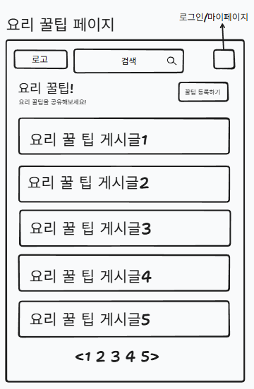

- 출력 데이터 항목 (Output Data):
  - GNB 영역:
    - 서비스 로고
    - 검색어 입력 폼
    - 회원 인증 상태 정보:
      - 비로그인 시: 로그인 버튼
      - 로그인 시: MY 셀렉트 박스 (마이페이지 이동, 내 정보 수정, 로그아웃) 및 레시피 등록 버튼
  - 타이틀 및 헤더 영역:
    - 페이지 타이틀 (요리 꿀팁!)
    - 서브 텍스트 (요리 꿀팁을 공유해보세요!)
    - 꿀팁 등록하기 버튼
  - 요리 꿀팁 게시글 목록 영역 (DB: `post` 테이블, `post_type = 2` 인 데이터):
    - 꿀팁 게시글 항목
  - 하단 영역:
    - 페이지(이전/다음 화살표 및 페이지 번호)

- 화면 제어 및 권한 규칙 (Behavior Rules):
  - 서비스 로고 클릭 시 메인 화면(GET /)으로 이동합니다.
  - 검색어 입력 및 제출 시 키워드에 해당하는 요리 꿀팁 목록을 검색하여 조회합니다.
  - 꿀팁 등록하기 버튼 클릭 시:
    - 로그인 상태: 요리 꿀팁 작성 페이지(GET /posts/form)로 이동합니다.
    - 비로그인 상태: 로그인 안내 메시지 노출 후 로그인 페이지(GET /login)로 이동합니다.
  - 요리 꿀팁 게시글 항목 클릭 시: 해당 게시글의 상세 페이지(GET /tipposts/{postId})로 이동합니다. (이때 postId는 DB post 테이블의 id 값과 매핑됩니다)
  - 페이지 번호 및 화살표 클릭 시: 해당하는 페이지의 요리 꿀팁 목록 데이터로 화면을 갱신합니다.
  - 비로그인 상태: GNB 영역의 로그인 버튼 클릭 시 로그인 페이지로 이동합니다.
  - 로그인 상태: GNB 영역의 MY 메뉴 및 레시피 등록 버튼이 활성화되며, 레시피 등록 버튼 클릭 시 레시피 작성 페이지(GET /recipeposts/form)로 이동합니다.

### 2.7 요리 꿀팁 상세 페이지 (GET `/post/{postId}`)
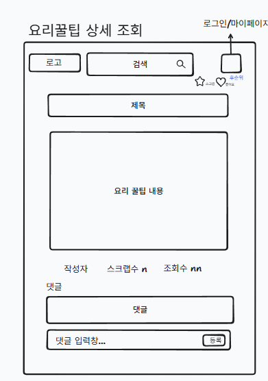

- 출력 데이터 항목 (Output Data):
  - GNB 영역:
    - 서비스 로고
    - 검색어 입력 폼
    - 회원 인증 상태 정보:
      - 비로그인 시: 로그인 버튼
      - 로그인 시: MY 셀렉트 박스 (마이페이지 이동, 내 정보 수정, 로그아웃) 및 레시피 등록 버튼
  - 상단 액션 영역:
    - 스크랩 버튼 (별 아이콘 /DB: `like`테이블, `like_type =3`)
    - 좋아요 버튼 (하트 아이콘 / DB: `like` 테이블, `like_type = 2`)
  - 게시글 정보 및 본문 영역 (DB: `post` 테이블, `post_type = 2`):
    - 게시글 제목 (DB: `title`)
    - 요리 꿀팁 내용 본문 (DB: `content`)
  - 게시글 메타 정보 영역:
    - 작성자 닉네임/프로필 (DB: `member` 테이블 참조)
    - 스크랩수 (n개 / DB: `like` 테이블에서 해당 `post_id`와 `like_type = 3`인 레코드 수 카운트)
    - 조회수 (n회 / DB: `view_count`)
  - 댓글 영역 (DB: `reply` 테이블):
    - 댓글 목록  (작성자, 작성 내용, 작성일시 등 / DB: `reply` 테이블에서 해당 `post_id`로 조회)
    - 댓글 입력 폼 (텍스트 입력창, 등록 버튼)

- 화면 제어 및 권한 규칙 (Behavior Rules):
  - 서비스 로고 클릭 시 메인 화면(GET `/`)으로 이동합니다.
  - 검색어 입력 및 제출 시 해당 키워드의 검색 결과 화면으로 이동합니다.
  - 스크랩(별) 및 좋아요(하트) 버튼 클릭 시:
    - 로그인 상태: 상태가 토글(등록/취소)되며 카운트가 업데이트됩니다.
    - 비로그인 상태: 로그인 안내 알림창 노출 후 로그인 페이지(GET `/login`)로 이동합니다.
  - 작성자 닉네임 클릭 시 해당 작성자의 프로필 페이지(GET `/members/{memberId}`)로 이동합니다.
  - 댓글 등록 클릭 시:
    - 로그인 상태: 입력한 댓글 내용이 DB에 저장(post_id, member_id 매핑)되고 댓글 목록이 즉시 갱신됩니다.
    - 비로그인 상태: 로그인 안내 알림창 노출 후 로그인 페이지로 이동합니다.
  - 비로그인 상태: GNB 영역의 로그인 버튼 클릭 시 로그인 페이지로 이동합니다.
  - 로그인 상태: GNB 영역의 MY 메뉴 및 레시피 등록 버튼이 활성화되며, 레시피 등록 버튼 클릭 시 레시피 작성 페이지(GET /recipeposts/form)로 이동합니다.

### 2.8 요리 꿀팁 등록 화면 (GET `/post/form?type=2`)
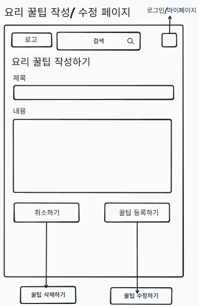

- 출력 데이터 및 입력 폼 항목 (Output & Input Data):
  - GNB 영역:
    - 서비스 로고
    - 검색어 입력 폼
    - 회원 인증 상태 정보:
      - 로그인 상태 전용 화면이므로 MY 셀렉트 박스 및 레시피 등록 버튼 활성화
  - 타이틀 영역:
    - 페이지 타이틀 (요리 꿀팁 작성하기)
  - 텍스트 입력 영역 (DB: `post` 테이블, `post_type = 2`로 매핑):
    - 제목 입력칸 (DB: `title`)
    - 내용 입력칸 (DB: `content`)
  - 하단 액션 버튼 영역:
    - 취소하기 버튼
    - 꿀팁 등록하기 버튼

- 화면 제어 및 권한 규칙 (Behavior Rules):
  - 서비스 로고 클릭 시 메인 화면(GET `/`)으로 이동합니다.
  - 취소하기 버튼 클릭 시: 작성 중인 모든 내용이 초기화(파기)되며, 이전 페이지 또는 요리 꿀팁 목록 화면(GET /tipposts)으로 이동합니다.
  - 꿀팁 등록하기 버튼 클릭 시:
    - 제목과 내용 등 필수 항목이 모두 입력되었는지 유효성 검사를 진행합니다.
    - 모든 데이터가 정상 입력되었다면 폼 데이터를 서버로 전송하여 DB에 저장(POST `/post`)합니다.
    - 저장이 완료되면 방금 작성한 요리 꿀팁의 상세 페이지(GET `/post/{postId}`)로 즉시 이동합니다.

### 2.9 요리 꿀팁 수정 화면 (GET /post/{postId}/t-edit)

- 출력 데이터 및 입력 폼 항목 (Output & Input Data):
  - GNB 영역:
    - 서비스 로고
    - 검색어 입력 폼
    - 로그인/마이페이지 아이콘 (회원 인증 상태 노출)
  - 타이틀 영역:
    - 페이지 타이틀 (요리 꿀팁 작성하기 - ※ 수정 모드로 동작)
  - 기존 데이터 바인딩(미리 채워짐) 영역 (DB: `post` 테이블의 해당 `id` 데이터, `post_type = 2`):
    - 제목: 기존에 입력된 제목(`title`) 노출
    - 내용: 기존에 작성된 꿀팁 본문(`content`) 노출
  - 하단 액션 버튼 영역 (※ 화살표 지시사항 반영):
    - 꿀팁 삭제하기 버튼
    - 꿀팁 수정하기 버튼

- 화면 제어 및 권한 규칙 (Behavior Rules):
  - 화면 접근 권한: 로그인한 상태이면서, 해당 꿀팁 게시글의 **작성자 본인**(DB `post` 테이블의 `member_id`와 현재 로그인한 ID가 일치)만 접근 가능한 페이지입니다. 권한이 없는 사용자가 접근 시 알림 후 이전 페이지나 메인 화면으로 강제 이동(리다이렉트)됩니다.
  - 화면 진입 시: 서버에서 URL의 `{postId}`에 해당하는 요리 꿀팁 데이터를 불러와 제목과 내용 폼에 기존 작성 내용을 미리 채워줍니다(Pre-loading).
  - 꿀팁 삭제하기 버튼 클릭 시:
    - "정말 이 요리 꿀팁을 삭제하시겠습니까?" 등의 재확인 모달(Confirm)을 띄웁니다.
    - [확인] 클릭 시 서버(DELETE /tipposts/{postId})로 삭제를 요청하여 DB에서 해당 게시글을 삭제하고, 요리 꿀팁 목록 화면(GET /tipposts) 또는 마이페이지로 이동시킵니다.
  - 꿀팁 수정하기 버튼 클릭 시:
    - 제목이나 내용이 비어있지 않은지 유효성 검사(Validation)를 진행합니다.
    - 모든 항목이 정상적으로 입력되었다면 서버(PUT 또는 PATCH /tipposts/{postId})로 데이터를 전송하여 DB의 내용을 업데이트합니다.
    - 수정 처리가 완료되면, 마이페이지 페이지(GET /tipposts/{postId})로 즉시 이동합니다.
### 2.10 오늘 뭐먹지 (랜덤 추천) 화면 (GET `/today-recipes`)
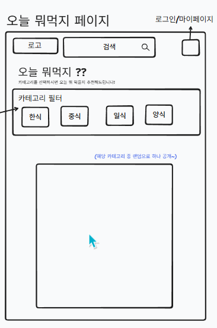

- 출력 데이터 항목 (Output Data):
  - GNB 영역:
    - 서비스 로고
    - 검색어 입력 폼
    - 회원 인증 상태 정보:
      - 비로그인 시: 로그인 버튼
      - 로그인 시: 마이페이지 프로필 아이콘
  - 타이틀 및 안내 영역:
    - 메인 타이틀 ("오늘 뭐먹지 ??")
    - 서브 텍스트 ("카테고리를 선택하시면 오늘 먹을 레시피 추천해드립니다!")
  - 카테고리 필터 영역 (DB: `category` 테이블 참조):
    - 대표 카테고리 선택 버튼 (한식, 중식, 일식, 양식 등)
  - 랜덤 추천 결과 영역 (DB: `post` 테이블 참조):
    - 선택된 카테고리(`category_id`)와 레시피 게시글(`post_type = 1`) 조건에 일치하는 데이터 중 랜덤으로 1개를 추출하여 표시
    - 노출 항목: 레시피 대표 이미지(`main_image`)

- 화면 제어 및 권한 규칙 (Behavior Rules):
  - 서비스 로고 클릭 시 메인 화면(GET /)으로 이동합니다.
  - 검색어 입력 및 제출 시 키워드에 해당하는 레시피 검색 결과 화면으로 이동합니다.
  - 카테고리 버튼(한식, 중식, 일식, 양식) 클릭 시:
    - DB에서 해당 카테고리에 속한 레시피 중 하나를 무작위로(Random) 불러와 하단 빈 영역에 출력합니다.
    - 다른 카테고리를 누르거나, 동일한 카테고리를 다시 누를 경우 새로운 랜덤 레시피로 화면이 갱신됩니다.
  - 추천된 레시피 결과물(사진) 클릭 시: 해당 레시피의 상세 페이지(GET `/post(type = 1)/{postId}`)로 이동합니다.
  - 비로그인 상태: 로그인 버튼 클릭 시 로그인 페이지(GET `/login`)로 이동합니다.

### 2.11 회원가입 화면 (GET `/member/signup`)
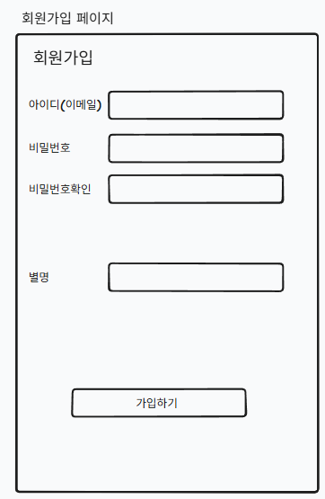

- 출력 데이터 및 입력 폼 항목 (Output & Input Data):
  - 타이틀 영역:
    - 페이지 타이틀 (회원가입)
  - 회원 정보 입력 영역 (DB: `member` 테이블과 매핑):
    - 아이디(이메일) 입력 폼 (DB: `email`)
    - 비밀번호 입력 폼 (DB: `password`)
    - 비밀번호 확인 입력 폼 (비밀번호 일치 여부 검증용)
   
    - 별명 입력 폼 
    - 전화번호 입력 폼 ('-' 제외 숫자만 입력)
  - 하단 액션 버튼 영역:
    - 가입하기 버튼

- 화면 제어 및 권한 규칙 (Behavior Rules):
  - 아이디(이메일) 입력 시: 이메일 형식(example@domain.com) 유효성 검사를 진행하며, 이미 가입된 중복 이메일인지 서버(DB)와 통신하여 확인합니다.
  - 비밀번호 확인 로직: '비밀번호' 항목과 '비밀번호 확인' 항목에 입력된 값이 정확히 일치하는지 등록 시 검증합니다.
  - 전화번호 유효성 검사: '-' 기호 없이 숫자만 올바르게 입력되었는지 확인합니다.
  - 가입하기 버튼 클릭 시:
    - 모든 필수 항목(이메일, 비밀번호, 비밀번호 확인, 이름, 별명, 전화번호)이 누락 없이 입력되었는지 유효성 검사를 진행합니다.
    - 누락되거나 형식에 맞지 않는 항목이 있을 경우, 해당 폼으로 포커스를 이동하고 안내 메시지(또는 알림창)를 띄웁니다.
    - 모든 검증을 통과하면 입력된 데이터를 서버로 전송하여 신규 회원 데이터로 DB에 저장합니다.
    - 정상적으로 회원가입이 완료되면 환영 메시지 노출 후 로그인 페이지(GET /login)로 즉시 이동합니다.

### 2.12 사용자 로그인 화면 (GET `/login`)
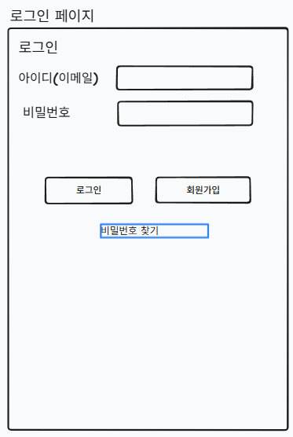

- 출력 데이터 및 입력 폼 항목 (Output & Input Data):
  - 타이틀 영역:
    - 페이지 타이틀 (로그인)
  - 계정 정보 입력 영역 (DB: `member` 테이블 참조):
    - 아이디(이메일) 입력 폼 (DB: `email`)
    - 비밀번호 입력 폼 (DB: `password`)
  - 하단 액션 버튼 및 링크 영역:
    - 로그인 버튼
    - 회원가입 버튼
    - 아이디/비밀번호 찾기 텍스트 링크

- 화면 제어 및 권한 규칙 (Behavior Rules):
  - 로그인 버튼 클릭 시:
    - 아이디(이메일) 또는 비밀번호 입력칸이 비어있는지 1차로 유효성 검사를 진행합니다.
    - 빈칸이 있을 경우 해당 폼으로 포커스를 이동하며 안내 메시지를 띄웁니다.
    - 모두 입력되었다면 서버로 데이터 전송(POST /login)하여 DB의 `member` 정보와 대조를 진행합니다.
    - 인증 성공 시: 로그인 상태(세션/토큰 등)로 전환되며 메인 화면(GET /) 또는 로그인 직전에 머물던 이전 페이지로 이동합니다.
    - 인증 실패 시: "아이디 또는 비밀번호가 일치하지 않습니다" 등의 안내 알림창을 띄우고 재입력을 유도합니다.
  - 회원가입 버튼 클릭 시:
    - 신규 회원가입 페이지(GET /member/signup)로 즉시 이동합니다.
  - 아이디/비밀번호 찾기 클릭 시:
    - 등록된 계정 정보를 찾을 수 있는 페이지(예: GET /member/find)로 이동합니다.

### 2.13 비밀번호 찾기 화면 (GET `/member/find`)
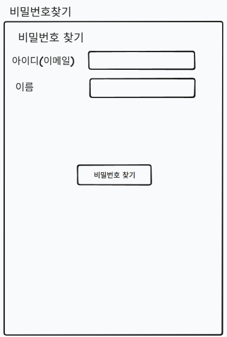

- 출력 데이터 및 입력 폼 항목 (Output & Input Data):
  - 타이틀 영역:
    - 페이지 타이틀  (비밀번호 찾기)
  - 정보 입력 영역 (DB: `member` 테이블 참조):
    - 아이디(이메일) 입력 폼 (DB: `email` - 가입 시 사용한 이메일)
    - 이름 입력 폼 (DB: `name` 또는 추가될 실명 컬럼)
  - 하단 액션 버튼 및 링크 영역:
    - 비밀번호 찾기 버튼
    

- 화면 제어 및 권한 규칙 (Behavior Rules):
  - 화면 접근 권한: 비로그인 상태의 사용자만 접근 가능합니다. 이미 로그인된 사용자가 접근 시 메인 화면(GET /)으로 강제 이동(리다이렉트)됩니다.
  - 비밀번호 찾기 버튼 클릭 시:
    - 아이디(이메일)와 별명 입력칸이 모두 작성되었는지 유효성 검사(Validation)를 진행합니다.
    - 빈칸이 있을 경우 안내 메시지를 노출합니다.
    - 모두 입력되었다면 서버(POST /members/find-password)로 전송하여 DB의 `member` 테이블 데이터와 대조합니다.
    - 정보 일치 시: 비밀번호를 화면에 띄워줍니다.
    - 정보 불일치 시: "입력하신 정보와 일치하는 계정이 없습니다." 등의 안내 메시지를 노출합니다.

### 2.14 회원정보 수정 화면 (GET `/member/{memberId}/edit`)
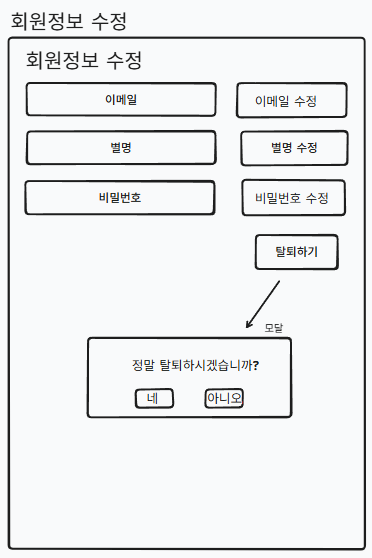

- 출력 데이터 및 입력 폼 항목 (Output & Input Data):
  - 타이틀 영역:
    - 페이지 타이틀 (회원정보 수정)
  - 회원 정보 수정 영역 (DB: `member` 테이블 참조):
    - 이메일 항목: 현재 등록된 이메일이 출력되는 텍스트 입력 폼 (DB: `email`) 및 [이메일 수정] 버튼
    - 별명 항목: 현재 등록된 별명이 출력되는 텍스트 입력 폼 (DB: `name`) 및 [별명 수정] 버튼
    - 비밀번호 항목: 현재 비밀번호 (DB: `password`, 화면 마스킹 처리) 및 [비밀번호 수정] 버튼
  - 하단 액션 버튼 영역:
    - 탈퇴하기 버튼
    - 회원 탈퇴 확인 (안내 메시지: "정말 탈퇴하시겠습니까?", [네] 버튼, [아니오] 버튼)

- 화면 제어 및 권한 규칙 (Behavior Rules):
  - 화면 접근 권한: 로그인한 본인(인증된 계정 정보와 URL의 `{memberId}`가 일치하는 사용자)만 접근 가능한 페이지입니다. 타인이나 비로그인 사용자가 접근 시 메인 화면(GET /)으로 강제 이동(리다이렉트)됩니다.
  - 개별 수정 버튼(이메일/별명/비밀번호 수정) 클릭시:
    - 변경을 위해 입력된 기존에 입력된 정보를 지우고 새로운 정보를 입력합니다.
    - 처리가 완료되면 "성공적으로 수정되었습니다" 등의 알림을 노출합니다.
  - 탈퇴하기 버튼 클릭 시:
    - 즉시 탈퇴 처리되지 않으며, 사용자의 최종 의사를 묻는 확인 모달창이 화면 중앙에 팝업됩니다.
  - 탈퇴 모달창 제어:
    - [no] 버튼 클릭 시: 탈퇴 진행이 취소되며 모달창이 닫힙니다.
    - [ok] 버튼 클릭 시: 서버(DELETE /members/{memberId})로 탈퇴 요청을 전송합니다. DB에서 회원 데이터가 삭제(혹은 비활성화/탈퇴 상태로 업데이트) 처리되며, 즉시 로그아웃 처리 후 서비스 메인 화면(GET /)으로 이동합니다. 

### 2.15 프로필(마이페이지) 화면 (GET `/member/{memberId}`)
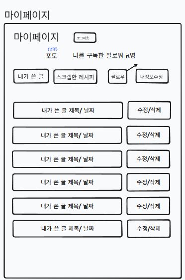

- 출력 데이터 항목 (Output Data):
  - 상단 액션 영역:
    - 타이틀 (마이페이지)
    - 로그아웃 버튼
  - 프로필 정보 영역 (DB: `member`, `follow` 테이블 참조):
    - 별명 (DB: `nickname`)
    - 팔로워 수 텍스트 ("나를 구독한 팔로워 n명" / DB: `follow` 테이블에서 `follower_id`가 해당 `{memberId}`인 레코드 수 카운트)
  - 탭(Tab) 및 네비게이션 버튼 영역:

    - [내가 쓴 레시피] 버튼
    - [내가 쓴 꿀팁] 버튼 
    - [스크랩한 레시피] 버튼
    - [팔로우] 버튼
    - [내정보수정] 버튼
  - 콘텐츠 목록 영역 (기본 노출 화면 - '내가 쓴 글' 기준 / DB: `post` 테이블):
    - 작성한 게시글의 제목 및 작성 날짜 (DB: `title`, `created_at`)
    - 개별 게시글 제어 버튼: [수정] / [삭제]

- 화면 제어 및 권한 규칙 (Behavior Rules):
  - 로그아웃 버튼 클릭 시: 즉시 로그인 세션(또는 토큰)을 파기하고 비로그인 상태로 메인 화면(GET /)으로 이동합니다.
  - 네비게이션 버튼(탭) 클릭 시:
    - [내가 쓴 레시피]: 해당 회원이 작성한 게시글(`post_type=1` ) 목록을 하단에 출력합니다.
    - [내가 쓴 꿀팁]: 해당 회원이 작성한 게시글(`post_type-2`) 목록을 하단에 출력합니다.
    - [스크랩한 레시피]: 해당 회원이 스크랩(`like` 테이블의 `like_type = 3`)한 레시피 목록으로 하단 데이터를 갱신합니다.
    - [팔로우]: 구독 페이지로 이동합니다.
    - [내정보수정]: 회원정보 수정 페이지(GET /members/{memberId}/edit)로 이동합니다.
  - 콘텐츠 목록 클릭 제어:
    - 목록 내 게시글 제목/날짜 영역 클릭 시: 해당 게시글의 상세 페이지(레시피 혹은 꿀팁 상세 조회)로 이동합니다.
    - 수정/삭제 버튼 클릭시 수정/삭제 페이지로 이동

### 2.16 다른 사람 프로필 페이지 (GET `/member/{memberId}`)
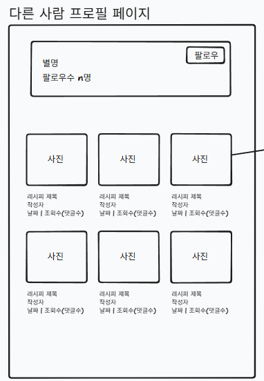

- 출력 데이터 항목 (Output Data):
  - 프로필 정보 영역 (DB: `member`, `follow` 테이블 참조):
    
    - 별명 (DB: `name`)
    - 팔로워 수 텍스트 ("팔로우수 n명" / DB: `follow` 테이블에서 `follower_id`가 해당 `{memberId}`인 레코드 수 카운트)
    - 팔로우 버튼 (DB: 현재 로그인한 사용자가 이 회원을 팔로우 중인지 여부에 따라 '팔로우' 또는 '언팔로우/팔로잉' 상태 표시)
  - 작성 글 목록 영역 (그리드 형태 / DB: `post`, `reply` 테이블 참조):
    - 해당 회원이 작성한 게시글(주로 레시피) 카드 리스트
    
    - 레시피 제목 (DB: `title`)
    - 작성자 (DB: `nickname` - 해당 프로필의 주인이 됨)
    - 작성 날짜 (DB: `created_at`)
    - 조회수 (DB: `view_count`)
    - 댓글수 (DB: `reply` 테이블에서 해당 `post_id`에 달린 레코드 수 카운트)

- 화면 제어 및 권한 규칙 (Behavior Rules):
  
  - 팔로우 버튼 클릭 시:
    - 로그인 상태: DB의 `follow` 테이블에 구독 정보(`following_id` = 내 ID, `follower_id` = 상대방 ID)를 추가(INSERT)하거나 삭제(DELETE)하여 상태를 토글합니다.
    - 비로그인 상태: "로그인이 필요한 서비스입니다." 등의 안내 알림창 노출 후 로그인 페이지(GET /login)로 이동합니다.
  - 작성 글(레시피 카드) 클릭 시:
    - 해당 카드의 이미지나 텍스트 영역 클릭 시, 클릭한 게시글의 레시피 상세 페이지(GET /recipeposts/{postId})로 이동합니다.

### 2.17 팔로우 피드 페이지 (GET `/subscriptions`)
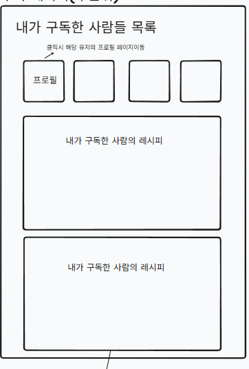

- 출력 데이터 항목 (Output Data):
  - 내가 구독한 사람들 목록 영역 (상단 프로필 가로 영역):
    - DB 조건: `follow` 테이블에서 `following_id`(팔로우 주체)가 현재 로그인한 사용자의 ID인 데이터를 조회하여, 연결된 `follower_id`(팔로우 대상)의 회원 정보를 가져옵니다.
    - 출력 항목: 구독한 대상 회원의 별명(`name`).
  - 구독 피드 게시글 영역 (하단 영역):
    - DB 조건: 내가 팔로우 중인 대상자(`follower_id` 목록)들이 작성한 게시글을 `post` 테이블에서 최신순(`created_at` DESC)으로 조회합니다. (주로 `post_type = 1` 인 레시피 게시글)
    - 출력 항목: 제목(`title`), 작성자 별명, 내용 일부 등.

- 화면 제어 및 권한 규칙 (Behavior Rules):
  - 상단 프로필 클릭 시:
    - "클릭 시 해당 유저의 프로필 페이지 이동"이라는 요구사항에 맞추어, 클릭한 대상자의 다른 사람 프로필 페이지(GET `/members/{memberId}`)로 이동합니다. (이때 `{memberId}`는 클릭한 대상의 DB `id` 값입니다.)
  - 하단 레시피 피드 영역 클릭 시:
    - 노출된 특정 '내가 구독한 사람의 레시피' 카드(박스)를 클릭하면, 해당 게시글의 레시피 상세 화면(GET `/post/{postId}`)으로 이동합니다.
## 3. 전체 화면 와이어프레임 배치도
- [와이어프레임 통합 파일 링크](https://www.tldraw.com/f/W34odRZEVIts2UaVExVTj?d=v3466.-1480.2495.1432.page)

